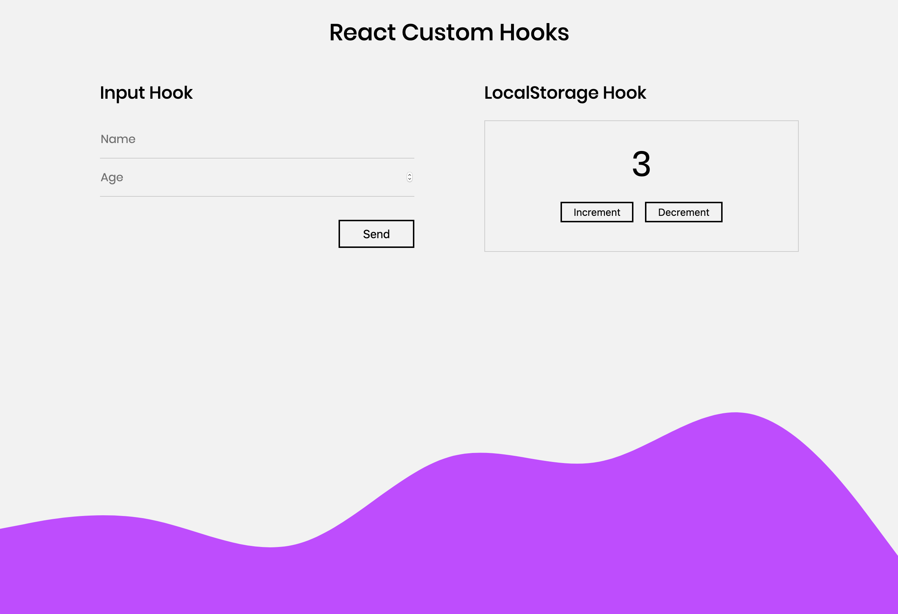

# React custom Hooks

Demo for defining our own custom hooks.

## Custom Hooks

1. **useInput** get and set values for form inputs using `useState` and `onChange` event.
2. **useLocalStorage** if more than a component needs to get and/or set localStorage values
